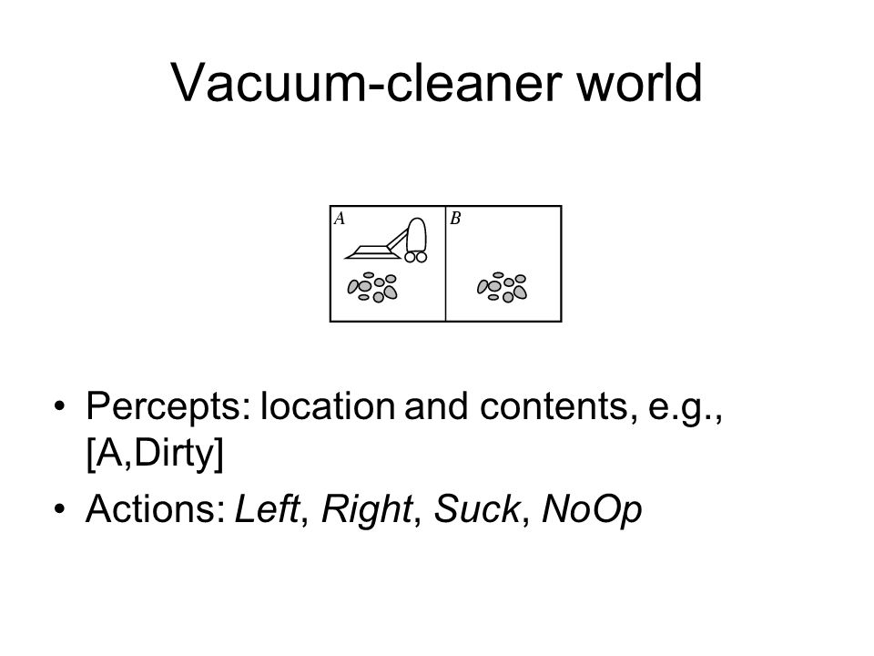

# Noop et Al



This small library generates standard implementations of a given interface:

 * `@Noop` generates a class that does nothing and returned default values (0 or <code>null</code>). Classes of that kind are 
   often used as base for classes that handle only some event/method calls of the annotated interface.
 * `@Decor` generates a class that passes all calls to another implementation of the interface. Really useful to
   create decorators.
 * `@Factory` generates a factory *interface* that provides instance of the marked interface. Mostly used in Android 
   when a Fragment expects it Activity to provide it with an instance.

```java
package com.company.example;

@Noop
@Decor
@Factory
interface ExampleInterface {

  void setProperty(String value);
  
  String calculateSomething(String param, int thistoo);
}
```

The generated code will look like this:
## @Noop

```java
package com.company.example;

/**
 * @Generated ..
 */
public class NoopExampleInterface {
  
  void setProperty(String ignored) { }
  
  String calculateSomething(String ignore1, int ignored2) {
    return null;
  }

}
```
## @Decor

This annotation has 2 attributes:

  - The name of the class, which can be defined in the `value` attribute.
  - Specifying the attribute `mutable` as `true` will generate a setter for the decorated property, so it can be changed
    after creation.
    
    
```java
package com.company.example;

/**
 * @Generated ..
 */
public class DecoratingExampleInterface {
  private final ExampleInterface decorated;
  
  public DecoratingExampleInterface(@NonNull ExampleInterface decorated) {
    this.decorated = decorated;
  }
  
  void setProperty(String value) {
    decorated.setProperty(value);
  }
  
  String calculateSomething(String param, int thistoo) {
    return decorated.calculateSomething(param, thistoo);
  }

}
```
## @Factory

```java
package com.company.example;

/**
 * @Generated ..
 */
public class ExampleInterfaceFactory {
  
  ExampleInterface createExampleInterface();

}
```

# Building and Relesing the app

## Automated build status
Thanks [Travis-CI](https://travis-ci.org) for providing a build system. The status of the last master build: [](https://travis-ci.org/pijpijpij/Noopetal)

## Build and install the app locally?

`> gradlew build` builds the app
`> gradlew install` places it in the local Maven repository.

## How to release the app?

That means creating a release version and prepare it for the next release increment. That includes setting up its SCM.
Releases are tagged with their version number (e.g. release 5.3.2 is build from he version tagged `5.3.2` in Git).

1. Checkout the head of `master` and start a command prompt
1. Run pre-release checks. Do a full build to ensure the code is good to be released.

    `> gradlew build`

1. Release (assuming authentication with SSH keys is already setup. If not, Bitbucket explained it well [here](https://confluence.atlassian.com/x/YwV9E)):

    `> gradlew release`

    Make sure the last output line indicates it's been *pushed to origin*.

    To set the release number, rather than accept the usal bug-level increment, add the following property on the command line:

    `-Prelease.forceVersion=k.m.n`

1. Build the release version of the app to take the new version number into account:

    `> gradlew build`


The overall command is:

    `> gradlew build release`
    `> gradlew build install`

# Miscellaneous

## Next features
Support annotating interfaces with super-interfaces.
Generate a decorator for non-final classes with non-final public methods.


## Download
Only source download available, from this site! Releases are tagged.

## Usage
To use, download the source for the version of interest, build it and install it in your local Maven repository.
Then, in a Maven project:
```xml
<dependency>
  <groupId>com.pij</groupId>
  <artifactId>com.pij.noopetal</artifactId>
  <version>1.2.0</version>
</dependency>
```
or Gradle for a Java project:
```groovy
compile 'com.pij:com.pij.noopetal:1.2.0'
```

For the SNAPSHOT version:
```xml
<dependency>
  <groupId>com.pij</groupId>
  <artifactId>com.pij.noopetal</artifactId>
  <version>1.2.0</version>
</dependency>
<dependency>
  <groupId>com.pij</groupId>
  <artifactId>com.pij.noopetal-compiler</artifactId>
  <version>1.2.0</version>
  <optional>true</optional>
</dependency>
```
or Gradle for an Android project:
```groovy
buildscript {
  dependencies {
    classpath 'com.neenbedankt.gradle.plugins:android-apt:1.8'
  }
}

apply plugin: 'com.neenbedankt.android-apt'

dependencies {
  compile 'com.pij:com.pij.noopetal:1.2.0'
  apt 'com.pij:com.pij.noopetal-compiler:1.2.0'
}
```

Finally, I started that project from [Butterknife](https://github.com/JakeWharton/butterknife)'s annotation processor.

## My License
    Copyright 2015 PJ Champault

    Licensed under the Apache License, Version 2.0 (the "License");
    you may not use this file except in compliance with the License.
    You may obtain a copy of the License at

       http://www.apache.org/licenses/LICENSE-2.0

    Unless required by applicable law or agreed to in writing, software
    distributed under the License is distributed on an "AS IS" BASIS,
    WITHOUT WARRANTIES OR CONDITIONS OF ANY KIND, either express or implied.
    See the License for the specific language governing permissions and
    limitations under the License.


## Other Licenses
    Copyright 2013 Jake Wharton

    Licensed under the Apache License, Version 2.0 (the "License");
    you may not use this file except in compliance with the License.
    You may obtain a copy of the License at

       http://www.apache.org/licenses/LICENSE-2.0

    Unless required by applicable law or agreed to in writing, software
    distributed under the License is distributed on an "AS IS" BASIS,
    WITHOUT WARRANTIES OR CONDITIONS OF ANY KIND, either express or implied.
    See the License for the specific language governing permissions and
    limitations under the License.


